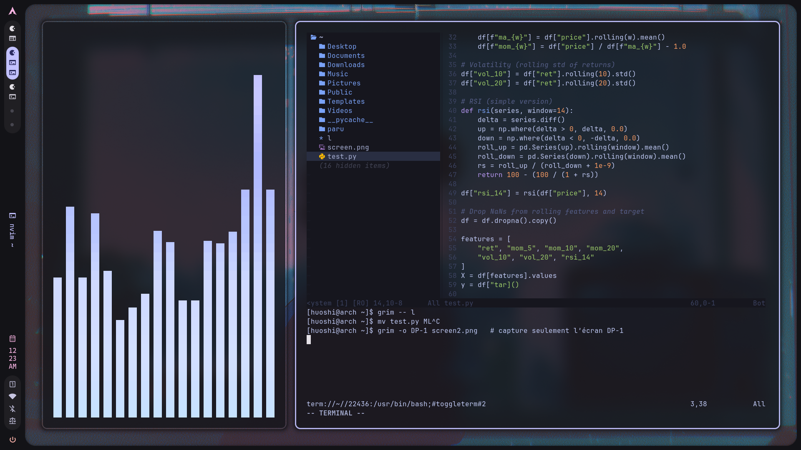

# Arch + Hyprland + Neovim Dots

Minimal setup for **Arch Linux**, with **Hyprland**, **Caelestia theme**, and a **clean Neovim config**.

---

## ✨ Features
- Hyprland WM with aesthetic Caelestia theme
- Minimal Neovim (lazy.nvim + only what I want)
- Transparent TokyoNight/Catppuccin highlights
- Integrated terminal + file explorer (Neo-tree)
- Clean dotfiles repo (only what matters)

---

## 🖼️ Screenshots

### Main setup


### Neovim with explorer & terminal


---

## ⚡ Usage

Clone into your `~/.config`:

```bash
git clone git@github.com:huosh1/arch-nvim-dots.git ~/.config
